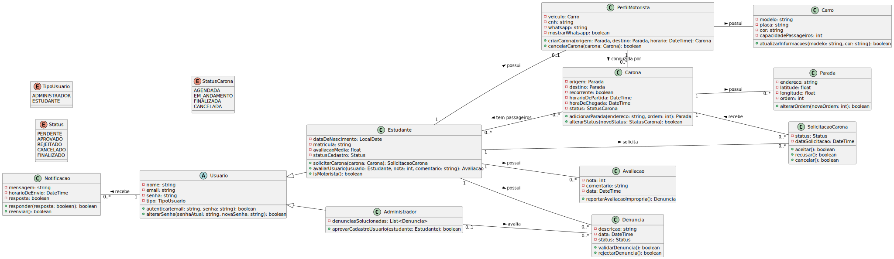

# Documento Arquitetura do Carona?

**Renato Matos Alves Penna, renatomapbusiness@gmail.com**

**Felipe Freitas Picinin, picinin.felipe2@gmail.com**

**Gabriel Pongelupe De Carvalho, gabrielpongelupee@gmail.com**

**Gabriel Ferreira, gabriel.afa@outlook.com**

**Pedro Araújo, pedrofr1313@gmail.com**

**Renato Cazzoletti, renato.cazzoletti7@gmail.com**

**José Victor Mendes Dias,  jose.dias.1433596@sga.pucminas.br**

---

Professores:

**Hugo Bastos de Paula**

**Cristiano de Macêdo Neto**

**Cleiton Silva Tavares**

---

_Curso de Engenharia de Software, Campus Lourdes_

_Instituto de Informática e Ciências Exatas – Pontifícia Universidade de Minas Gerais (PUC MINAS), Belo Horizonte – MG – Brasil_

---

_**Resumo**. O projeto Carona? é uma solução para facilitar a mobilidade dos estudantes da PUC Minas através de compartilhamento de caronas. O sistema aborda a dificuldade de transporte nos horários noturnos, conectando motoristas e passageiros. A plataforma inclui aplicativos mobile para usuários finais e interface web administrativa. A arquitetura baseia-se em Java Spring Boot no backend, React Native para aplicações móveis e MySQL para persistência de dados._

---

## Histórico de Revisões

| **Data**   | **Autor**               | **Descrição**                                | **Versão** |
| ---------- | ----------------------- | -------------------------------------------- | ---------- |
| 24/02/2025 | Renato Matos            | Seção 3 preliminar e nome alunos/professores | v0.1       |
| 25/02/2025 | José Victor Mendes Dias | Adicionando seção 1                          | v0.2       |
| 14/03/2025 | Renato Matos            | Adicionando diagrama arquitetural seção 4    | v0.3       |
| 18/03/2025 | José Victor Mendes Dias | Pequenos ajustes estruturais de documentação | v0.4       |

## SUMÁRIO

1. [Apresentação](#apresentacao "Apresentação")  
	1.1. Problema  
	1.2. Objetivos do trabalho  
	1.3. Definições e Abreviaturas  
 
2. [Nosso Produto](#produto "Nosso Produto")  
	2.1. Visão do Produto  
   	2.2. Nosso Produto  
   	2.3. Personas  

3. [Requisitos](#requisitos "Requisitos")  
	3.1. Requisitos Funcionais  
	3.2. Requisitos Não-Funcionais  
	3.3. Restrições Arquiteturais  
	3.4. Mecanismos Arquiteturais  

4. [Modelagem](#modelagem "Modelagem e projeto arquitetural")  
	4.1. Visão de Negócio  
	4.2. Visão Lógica  
	4.3. Modelo de dados (opcional)  

5. [Wireframes](#wireframes "Wireframes")  

6. [Solução](#solucao "Projeto da Solução")  

7. [Avaliação](#avaliacao "Avaliação da Arquitetura")  
	7.1. Cenários  
	7.2. Avaliação  

8. [Referências](#referencias "REFERÊNCIAS") 

9. [Apêndices](#apendices "APÊNDICES") 
	9.1 Ferramentas  

# 1. Apresentação

O projeto _*Carona?*_ é uma solução tecnológica voltada para estudantes da Pontifícia Universidade Católica de Minas Gerais (PUC Minas) que frequentam os campi de Belo Horizonte.

A plataforma foi desenvolvida para conectar motoristas e passageiros, permitindo a organização de caronas entre os alunos. Seu foco é proporcionar uma alternativa prática de mobilidade dentro da comunidade acadêmica.

## 1.1. Problema

A dificuldade de mobilidade dos estudantes nos horários noturnos representa um problema significativo. O transporte público é ineficiente, havendo poucas ou nenhuma opção de deslocamento após as aulas da noite. O que leva muitos alunos a buscar alternativas individuais para retornar às suas residências.

Além disso, o uso de aplicativos de transporte como Uber e 99 pode apresentar desafios. Dependendo do horário, os custos dessas opções podem ser elevados, os tempos de espera aumentam consideravelmente e algumas corridas podem ser recusadas, especialmente para regiões periféricas da cidade e da região metropolitana.

A ausência de uma infraestrutura de transporte adequada nesse período pode resultar em custos adicionais e deslocamentos menos organizados. O compartilhamento de veículos entre estudantes é uma prática comum, mas ocorre de maneira informal, sem um meio estruturado para facilitar e organizar essas interações.

## 1.2. Objetivos do trabalho

O objetivo principal do projeto _*Carona?*_ é oferecer um sistema de caronas para estudantes da PUC Minas, proporcionando uma alternativa de deslocamento entre a universidade e suas residências.

### Os objetivos específicos incluem:

- Desenvolver um sistema de cadastro para motoristas e passageiros, permitindo a criação e a busca de caronas.

- Criar um sistema de notificações para alertar usuários sobre novas caronas e mudanças nas viagens confirmadas.

- Criar um sistema de avaliação de motoristas e passageiros.

- Fornecer uma interface administrativa para que gestores possam monitorar e intervir em situações de denúncias e mau uso da plataforma.

## 1.3. Definições e Abreviaturas

*PUC Minas*: Pontifícia Universidade Católica de Minas Gerais.

*Carona?*: Nome do projeto que visa conectar motoristas e passageiros para compartilhamento de trajetos.

*Gestor*: Responsável por gerenciar usuários e manter a integridade do sistema.

*Carpool*: Termo em inglês que significa compartilhamento de veículos.

# 2. Nosso Produto

## 2.1 Visão do Produto

## 2.2 Nosso Produto

## 2.3 Personas
<h2>Persona 1</h2>
<table>
  <tr>
    <td style="vertical-align: top; width: 150px;">
      
    </td>
    <td style="vertical-align: top; padding-left: 10px;">
      <strong>Nome:</strong> Lucas Lutti  
      <strong>Idade:</strong> 22  
      <strong>Hobby:</strong> Pilotar Drones  
      <strong>Trabalho:</strong> Estagiario de Engenheria Mecanica  
      <strong>Personalidade:</strong> Comunicativo, incisivo  e determinado  
      <strong>Sonho:</strong> Ficar rico ainda jovem  
      <strong>Dores:</strong> Mora longe da faculdade perde muito tempo no translado  
    </td>
  </tr>
</table>

<h2>Persona 2</h2>
<table>
  <tr>
    <td style="vertical-align: top; width: 150px;">
      
    </td>
    <td style="vertical-align: top; padding-left: 10px;">
      <strong>Nome:</strong> Daniela Sofia  
      <strong>Idade:</strong> 25  
      <strong>Hobby:</strong> Estudar linguas  
      <strong>Trabalho:</strong> Estagiaria TI  
      <strong>Personalidade:</strong> Alegre, inteligente e amigavel  
      <strong>Sonho:</strong> Viajar o mundo  
      <strong>Dores:</strong> Quer companhia no trajeto da faculdade  
    </td>
  </tr>
</table>

# 3. Requisitos

A seguir serão apresentados os requisitos funcionais e não funcionais que guiaram o desenvolvimento da arquitetura do sistema Carona?.

## 3.1. Requisitos Funcionais

| **ID** | **Descrição** | **Prioridade** | **Complexidade** | **Plataforma** | 
| --- | --- | --- | --- | --- | 
| RF01 | Passageiro realiza login | Alta | Baixa | Mobile |  
| RF02 | Passageiro realiza cadastro | Alta | Baixa | Mobile |  
| RF03 | Passageiro se registra em carona existente | Alta | Média | Mobile |  
| RF04 | Passageiro vê caronas existentes próximas | Média | Alta | Mobile |  
| RF05 | Passageiro cancela registro de carona | Média | Baixa | Mobile |  
| RF06 | Passageiro ativa notificações | Baixa | Média | Mobile |  
| RF07 | Passageiro avalia motorista | Média | Baixa | Mobile |  
| RF08 | Passageiro visualiza histórico de viagens | Média | Baixa | Mobile |  
| RF09 | Motorista gerencia viagens | Alta | Média | Mobile |  
| RF10 | Motorista gerencia passageiros da viagem | Alta | Baixa | Mobile |  
| RF11 | Motorista realiza cadastro | Alta | Baixa | Mobile |  
| RF12 | Motorista realiza login | Alta | Baixa | Mobile |  
| RF13 | Motorista gerencia perfil | Alta | Média | Mobile |  
| RF14 | Motorista visualiza mapa | Média | Média | Mobile |  
| RF15 | Motorista vê histórico de viagem | Baixa | Baixa | Mobile |  
| RF16 | Motorista avalia passageiro | Média | Baixa | Mobile |  
| RF17 | Usuário denuncia outro usuário | Média | Baixa | Mobile |  
| RF18 | Administrador aprova novos usuários | Média | Baixa | Web |  
| RF19 | Administrador gerencia universidade | Alta | Média | Web |  
| RF20 | Administrador visualiza todas as viagens | Alta | Média | Web |  
| RF21 | Administrador gerencia usuários | Alta | Baixa | Web |  
| RF22 | Administrador gerencia denúncias | Média | Baixa | Web |  

## 3.2. Requisitos Não-Funcionais

| **ID** | **Descrição** |
| --- | --- |
| RNF01 | O token de autenticação deve expirar automaticamente após 7 dias de inatividade do usuário. Caso o usuário faça login novamente antes do vencimento, um novo token será gerado. A expiração deve ser validada no momento de cada requisição ao sistema. |
| RNF02 | O serviço deve estar disponível pelo menos de 6:00 às 13:00 e de 16:00 às 23:00 |
| RNF03 | O sistema deve funcionar em dispositivos Android 14 e 15 |
| RNF04 | O sistema deve ser capaz de processar e exibir os resultados de uma busca por caronas em menos de 2 segundos, considerando até 1.000 usuários simultâneos realizando buscas durante horários de pico." |

## 3.3. Restrições Arquiteturais

- O software deverá ser desenvolvido em Java Spring, React e React Native.
- A comunicação da API deve seguir o padrão RESTful.
- O software deve usar banco de dados relacional.

## 3.4. Mecanismos Arquiteturais

| **Análise** | **Design** | **Implementação** |
| --- | --- | --- |
| Persistência | Banco de dados relacional | MySQL |
| Front end | Framework de UI | React Native |
| Back end | API RESTful | Java Spring Boot |
| Integração | API de mapas | Google Maps API |
| Mensageria | Sistema de mensagens assíncronas | RabbitMQ |
| Deploy | | |

# 4. Modelagem e Projeto Arquitetural

## 4.1. Visão de Negócio (Funcionalidades)

_Apresente uma lista simples com as funcionalidades previstas no projeto (escopo do produto)._

1. O sistema deve...
2. O sistema deve...
3. ...

Obs: a quantidade e o escopo das funcionalidades deve ser negociado com os professores/orientadores do trabalho.

### Histórias de Usuário

- Como passageiro, quero buscar caronas disponíveis para encontrar uma opção que atenda à minha necessidade de deslocamento.

- Como passageiro, quero me registrar em uma carona existente para garantir meu lugar no veículo.

- Como passageiro, quero cancelar minha participação em uma carona para caso meus planos mudem.

- Como motorista, quero me cadastrar na plataforma para oferecer caronas.

- Como motorista, quero criar e gerenciar minhas viagens para oferecer caronas aos estudantes.

- Como motorista, quero avaliar passageiros para manter a qualidade da experiência.

|EU COMO... `PERSONA`| QUERO/PRECISO ... `FUNCIONALIDADE`   |PARA ... `MOTIVO/VALOR`                                            |
|--------------------|--------------------------------------|-------------------------------------------------------------------|
|Passageiro          | Buscar caronas disponíveis           | encontrar uma opção que atenda à minha necessidade de deslocamento|
|Passageiro          | me registrar em uma carona existente | garantir meu lugar no veículo                                     |
|Passageiro          | quero cancelar minha participação em uma carona     | caso meus planos mudem|
|Motorista           | quero me cadastrar na plataforma         | oferecer caronas|
|Motorista           | quero criar e gerenciar minhas viagens        |  oferecer caronas aos estudantes|
|Motorista           | quero avaliar passageiros        | manter a qualidade da experiência|

## 4.2. Visão Lógica

A seguir serão apresenta os diagramas que descrevem a estrutura lógica do sistema, incluindo o diagrama de classes e componentes. Estes artefatos serão utilizados para documentar as relações entre as entidades do sistema e para ilustrar como os componentes da aplicação comunicam entre si.

### Diagrama de Classes

O diagrama de classes abaixo representa a estrutura do sistema Carona?, detalhando as entidades, seus atributos, relacionamentos e hierarquias.

**Figura 2 – Diagrama de classes (exemplo). Fonte: o próprio autor.**

Obs: Acrescente uma breve descrição sobre o diagrama apresentado na Figura 3.

### Diagrama de componentes

O diagrama de componentes abaixo apresenta a arquitetura do sistema Carona, destacando os principais módulos, suas responsabilidades e as interações entre eles.

**Figura 3 – Diagrama de Componentes (exemplo). Fonte: o próprio autor.**

Na Figura 3, podemos ver a estrutura do sistema Carona dividida em dois grandes blocos: o Cliente e o Sistema Carona. O Cliente representa os dispositivos usados pelos usuários, como Mobile e Navegador Web, que servem como portas de entrada para a aplicação. Já o Sistema Carona engloba toda a parte responsável pelo processamento e armazenamento das informações, incluindo o Backend, o Banco de Dados e o RabbitMQ.

 PACOTES
- **Mobile** - Cliente da aplicação, responsável por interagir com o aplicativo.
- **Navegador web** - Cliente da aplicação, responsável por interagir com a aplicação via web.
- **Servidor de Aplicação** - Responsável por processar as requisições do cliente e interagir com o banco de dados.
- **MySQL** - Responsável por armazenar os dados da aplicação.

- **Componente 2** - Praesent nec nisi hendrerit, ullamcorper tortor non, rutrum sem. In non lectus tortor. Nulla vel tincidunt eros.

## 4.3. Modelo de dados (opcional)

_Caso julgue necessário para explicar a arquitetura, apresente o diagrama de classes ou diagrama de Entidade/Relacionamentos ou tabelas do banco de dados. Este modelo pode ser essencial caso a arquitetura utilize uma solução de banco de dados distribuídos ou um banco NoSQL._

 ")

**Figura 4 – Diagrama de Entidade Relacionamento (ER) - exemplo. Fonte: o próprio autor.**

Obs: Acrescente uma breve descrição sobre o diagrama apresentado na Figura 3.

# 5. Wireframes

> Wireframes são protótipos das telas da aplicação usados em design de interface para sugerir a
> estrutura de um site web e seu relacionamentos entre suas
> páginas. Um wireframe web é uma ilustração semelhante ao
> layout de elementos fundamentais na interface.

# 6. Projeto da Solução

_Apresente as telas dos sistema construído com uma descrição sucinta de cada uma das interfaces._

# 7. Avaliação da Arquitetura

_Esta seção descreve a avaliação da arquitetura apresentada, baseada no método ATAM._

## 7.1. Cenários

_Apresente os cenários de testes utilizados na realização dos testes da sua aplicação. Escolha cenários de testes que demonstrem os requisitos não funcionais sendo satisfeitos. Os requisitos a seguir são apenas exemplos de possíveis requisitos, devendo ser revistos, adequados a cada projeto e complementados de forma a terem uma especificação completa e auto-explicativa._

**Cenário 1 - Acessibilidade:** Suspendisse consequat consectetur velit. Sed sem risus, dictum dictum facilisis vitae, commodo quis leo. Vivamus nulla sem, cursus a mollis quis, interdum at nulla. Nullam dictum congue mauris. Praesent nec nisi hendrerit, ullamcorper tortor non, rutrum sem. In non lectus tortor. Nulla vel tincidunt eros.

**Cenário 2 - Interoperabilidade:** Pellentesque habitant morbi tristique senectus et netus et malesuada fames ac turpis egestas. Fusce ut accumsan erat. Pellentesque in enim tempus, iaculis sem in, semper arcu.

**Cenário 3 - Manutenibilidade:** Phasellus magna tellus, consectetur quis scelerisque eget, ultricies eu ligula. Sed rhoncus fermentum nisi, a ullamcorper leo fringilla id. Nulla lacinia sem vel magna ornare, non tincidunt ipsum rhoncus. Nam euismod semper ante id tristique. Mauris vel elit augue.

**Cenário 4 - Segurança:** Suspendisse consectetur porta tortor non convallis. Sed lobortis erat sed dignissim dignissim. Nunc eleifend elit et aliquet imperdiet. Ut eu quam at lacus tincidunt fringilla eget maximus metus. Praesent finibus, sapien eget molestie porta, neque turpis congue risus, vel porttitor sapien tortor ac nulla. Aliquam erat volutpat.

## 7.2. Avaliação

_Apresente as medidas registradas na coleta de dados. O que não for possível quantificar apresente uma justificativa baseada em evidências qualitativas que suportam o atendimento do requisito não-funcional. Apresente uma avaliação geral da arquitetura indicando os pontos fortes e as limitações da arquitetura proposta._

| **Atributo de Qualidade:** | Segurança |
| --- | --- |
| **Requisito de Qualidade** | Acesso aos recursos restritos deve ser controlado |
| **Preocupação:** | Os acessos de usuários devem ser controlados de forma que cada um tenha acesso apenas aos recursos condizentes as suas credenciais. |
| **Cenários(s):** | Cenário 4 |
| **Ambiente:** | Sistema em operação normal |
| **Estímulo:** | Acesso do administrador do sistema as funcionalidades de cadastro de novos produtos e exclusão de produtos. |
| **Mecanismo:** | O servidor de aplicação (Rails) gera um _token_ de acesso para o usuário que se autentica no sistema. Este _token_ é transferido para a camada de visualização (Angular) após a autenticação e o tratamento visual das funcionalidades podem ser tratados neste nível. |
| **Medida de Resposta:** | As áreas restritas do sistema devem ser disponibilizadas apenas quando há o acesso de usuários credenciados. |

**Considerações sobre a arquitetura:**

| **Riscos:** | Não existe |
| --- | --- |
| **Pontos de Sensibilidade:** | Não existe |
| _ **Tradeoff** _ **:** | Não existe |

Evidências dos testes realizados

_Apresente imagens, descreva os testes de tal forma que se comprove a realização da avaliação._

# 8. REFERÊNCIAS

_Como um projeto da arquitetura de uma aplicação não requer revisão bibliográfica, a inclusão das referências não é obrigatória. No entanto, caso você deseje incluir referências relacionadas às tecnologias, padrões, ou metodologias que serão usadas no seu trabalho, relacione-as de acordo com a ABNT._

Verifique no link abaixo como devem ser as referências no padrão ABNT:

http://www.pucminas.br/imagedb/documento/DOC\_DSC\_NOME\_ARQUI20160217102425.pdf

**[1]** - _ELMASRI, Ramez; NAVATHE, Sham. **Sistemas de banco de dados**. 7. ed. São Paulo: Pearson, c2019. E-book. ISBN 9788543025001._

**[2]** - _COPPIN, Ben. **Inteligência artificial**. Rio de Janeiro, RJ: LTC, c2010. E-book. ISBN 978-85-216-2936-8._

**[3]** - _CORMEN, Thomas H. et al. **Algoritmos: teoria e prática**. Rio de Janeiro, RJ: Elsevier, Campus, c2012. xvi, 926 p. ISBN 9788535236996._

**[4]** - _SUTHERLAND, Jeffrey Victor. **Scrum: a arte de fazer o dobro do trabalho na metade do tempo**. 2. ed. rev. São Paulo, SP: Leya, 2016. 236, [4] p. ISBN 9788544104514._

**[5]** - _RUSSELL, Stuart J.; NORVIG, Peter. **Inteligência artificial**. Rio de Janeiro: Elsevier, c2013. xxi, 988 p. ISBN 9788535237016._

# 9. APÊNDICES

_Inclua o URL do repositório (Github, Bitbucket, etc) onde você armazenou o código da sua prova de conceito/protótipo arquitetural da aplicação como anexos. A inclusão da URL desse repositório de código servirá como base para garantir a autenticidade dos trabalhos._

## 9.1 Ferramentas

| Ambiente  | Plataforma              |Link de Acesso |
|-----------|-------------------------|---------------|
|Repositório de código | GitHub | https://github.com/XXXXXXX | 
|Hospedagem do site | Heroku |  https://XXXXXXX.herokuapp.com | 
|Protótipo Interativo | MavelApp ou Figma | https://figma.com/XXXXXXX |
|Documentação de teste | Github | https://githun.com/xxxx |
